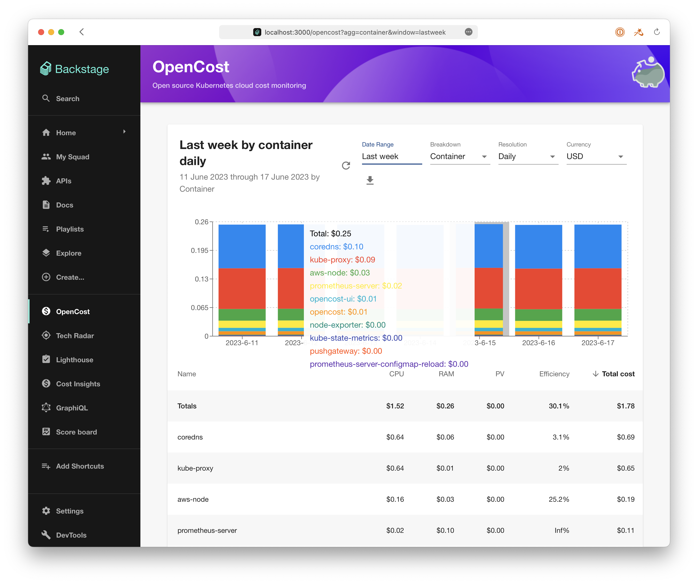

# OpenCost

Welcome to the [OpenCost](https://opencost.io) plugin!

Currently this is a port of the [OpenCost UI](https://github.com/opencost/opencost/tree/develop/ui), but we will continue to expand it to expose any relevant data or pre-configured views that may be preferred.

## Installation

1.  Add the OpenCost dependency to the `packages/app/package.json`:
    ```sh
    # From your Backstage root directory
    yarn add --cwd packages/app @backstage/plugin-opencost
    ```
2.  Add the `OpenCostPage` to your `packages/app/src/App.tsx`:

```tsx
import { OpenCostPage } from '@backstage/plugin-opencost';
```

and

```tsx
<FlatRoutes>
  …
  <Route path="/opencost" element={<OpenCostPage />} />
</FlatRoutes>
```

3.  Add link to OpenCost to your sidebar

    ```typescript
    // packages/app/src/components/Root/Root.tsx
     import MoneyIcon from '@material-ui/icons/MonetizationOn';

     ...

     export const Root = ({ children }: PropsWithChildren<{}>) => (
       <SidebarPage>
         <Sidebar>
           ...
          <SidebarItem icon={MoneyIcon} to="opencost" text="OpenCost" />
           ...
         </Sidebar>
       </SidebarPage>
     );

    ```

## Configuration

## TODO

- More testing
- Use the OpenCost mascot for the sidebar logo
- Use the Backstage proxy to communicate with the OpenCost API
- Convert AllocationReport.js to use the [Backstage Table](https://backstage.io/storybook/?path=/story/data-display-table--default-table)
- Allow for user-provided default reports and/or disabling controls
- Support multiple hard-coded reports
- Fork(?) to support Kubecost, which could provide Alerts and Recommendations, similar to the Cost Explorer plugin
- clean up deprecation warnings and upgrade to all the latest React components
- upgrade sidebar icon to https://mui.com/material-ui/material-icons/?query=money&selected=Savings


